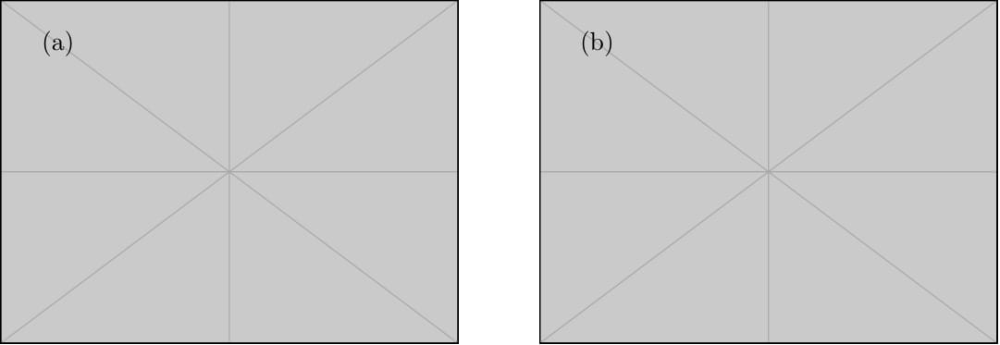
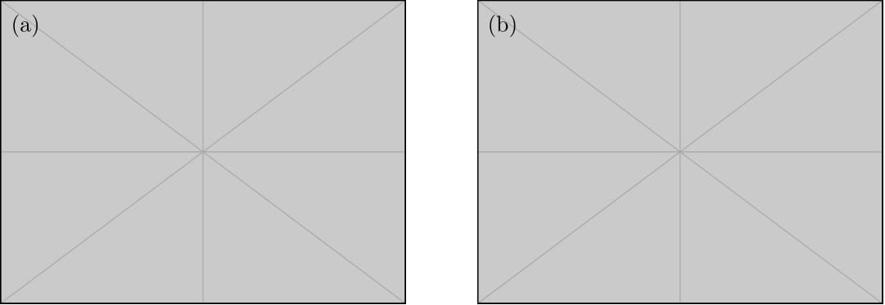
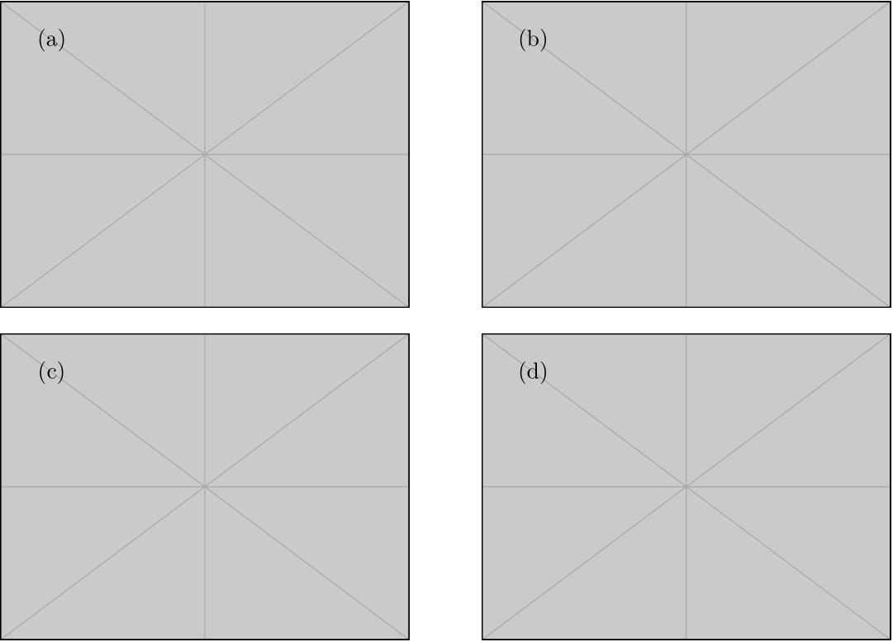
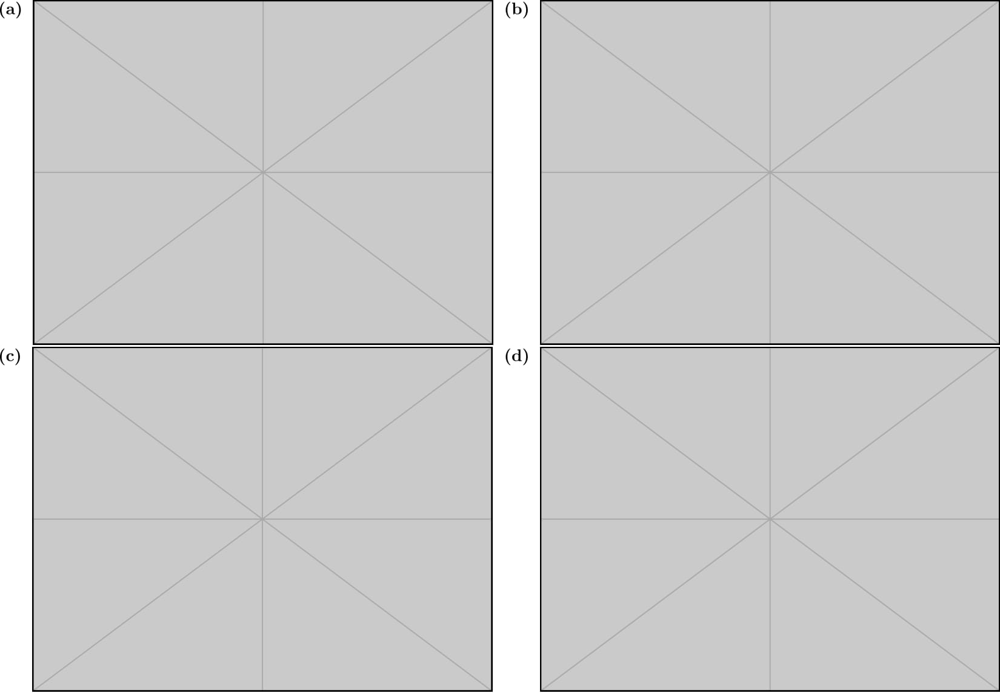
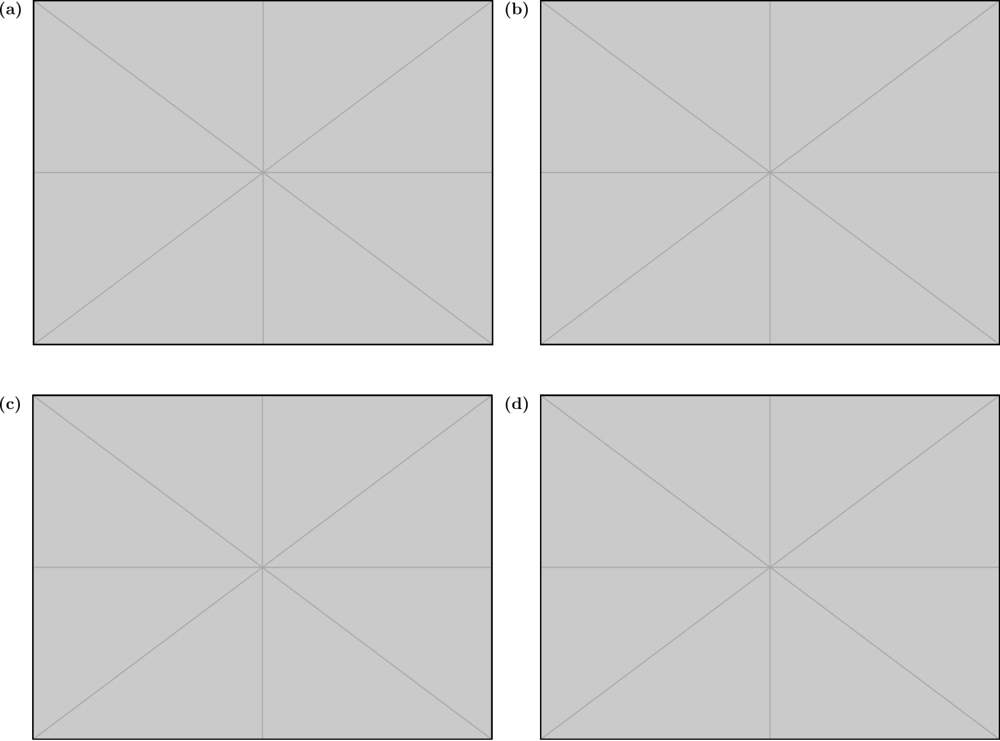
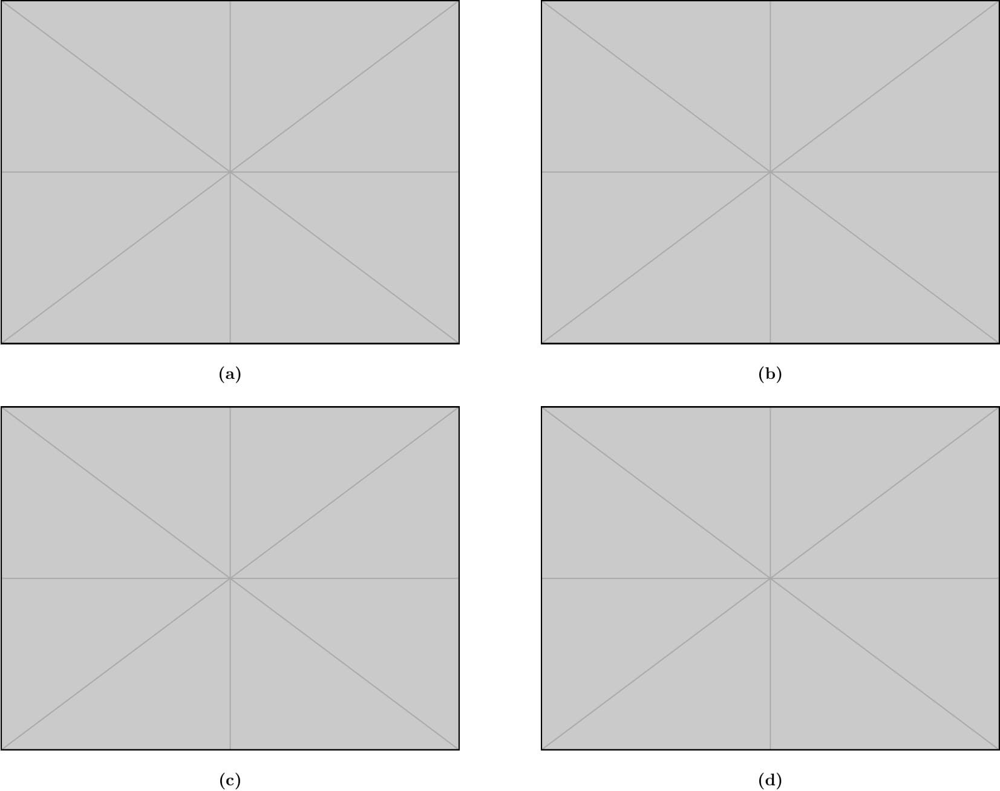
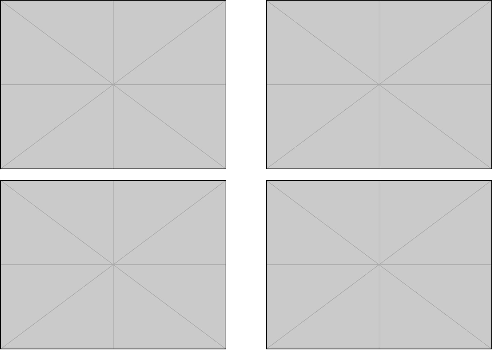
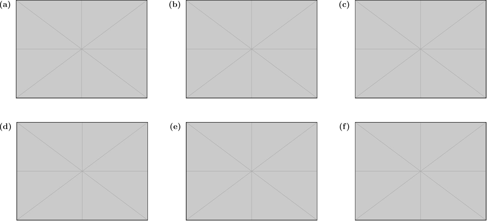
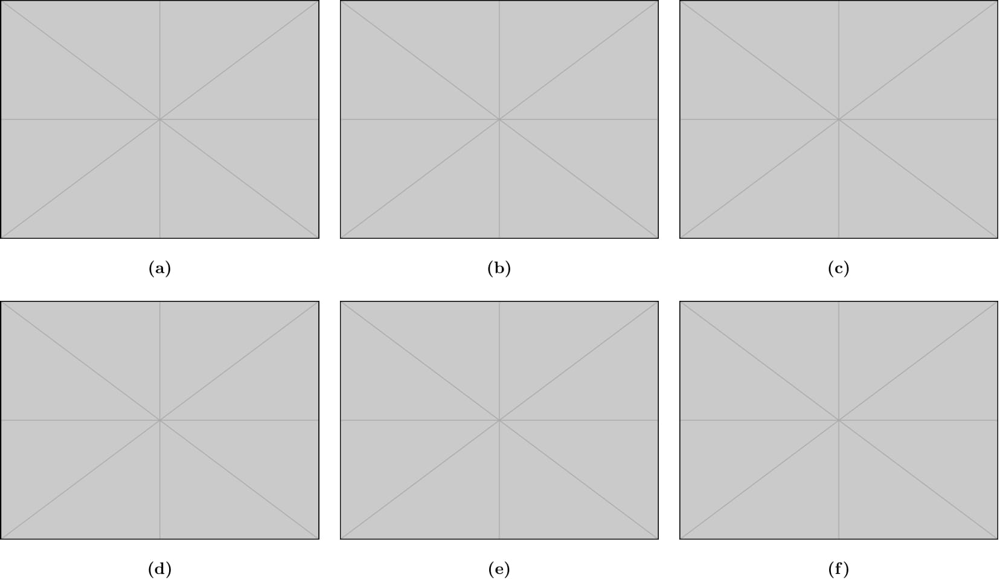

## `mfig` Examples:

- 2 images with index inside
```bash
mfig -i image.pdf image.pdf -o out.pdf -v 0 -it i
```

&nbsp;

- 2 images with index inside with a shift
```bash
mfig -i image.pdf image.pdf -o out.pdf -v 0 -it i -s -0.3 0.3
```

&nbsp;


- 4 images in 2x2 grid with index inside
```bash
mfig -i image.pdf image.pdf image.pdf image.pdf -o out.pdf -v 0 -it i
```

&nbsp;


- 4 images in 2x2 grid with index at top left corner
```bash
mfig -i image.pdf image.pdf image.pdf image.pdf -o out.pdf -v 0 -it t
```

&nbsp;


- 4 images in 2x2 grid with index at top left corner with spacing inbetween rows
```bash
mfig -i image.pdf image.pdf image.pdf image.pdf -o out.pdf -v 1 -it t
```

&nbsp;


- 4 images in 2x2 grid with index at bottom
```bash
mfig -i image.pdf image.pdf image.pdf image.pdf -o out.pdf -v 0 -it b
```

&nbsp;


- 4 images in 2x2 grid with no index
```bash
mfig -i image.pdf image.pdf image.pdf image.pdf -o out.pdf -v 0 -it n
```


&nbsp;

- 6 images in 2x3 grid with index at top left corner
```bash
mfig -i image.pdf image.pdf image.pdf image.pdf image.pdf image.pdf -o out.pdf -pr 3 -w 0.27 -v 0 -it t -v 1
```

&nbsp;


- 6 images in 2x3 grid with index at bottom

```bash
mfig -i image.pdf image.pdf image.pdf image.pdf image.pdf image.pdf -o out.pdf -pr 3 -w 0.32 -v 0 -it b
```

&nbsp;